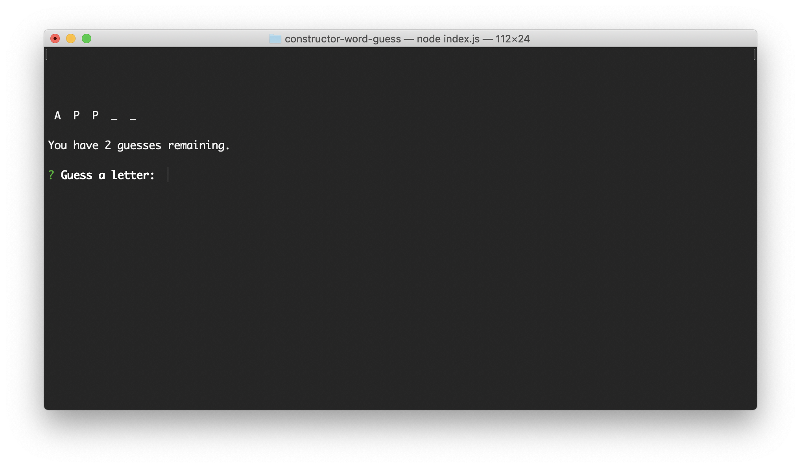

# Tech Company Word Guess

This project runs a Node.js word guess game. The user is given a random name of one of the top ten tech companies to guess. The user is given a number of guesses equal to the number of letters in the name of the tech company. The application features modularizaton of JavaScript constructors. 

## Video

[Click to see Video](https://drive.google.com/file/d/1EkiiBdmoyfLAJ5quyBmYePVJrOdSsqTJ/view)

The video link above shows an example of the game being played, first with an unsuccesful attempt, followed by a succesful attempt.

## Built With

* [Node.js](https://nodejs.org/en/)
* [inquirer](https://www.npmjs.com/package/inquirer)
  * A package for obtaining input from the user.

## Who maintains the project
This project was created by [Rafael Treviño](https://github.com/rafaeltrevino/) as part of the Full-Stack Web Developer Coding Boot Camp program offered at the [George Washington University](https://bootcamp.cps.gwu.edu/coding/) in Arlington, Virginia.